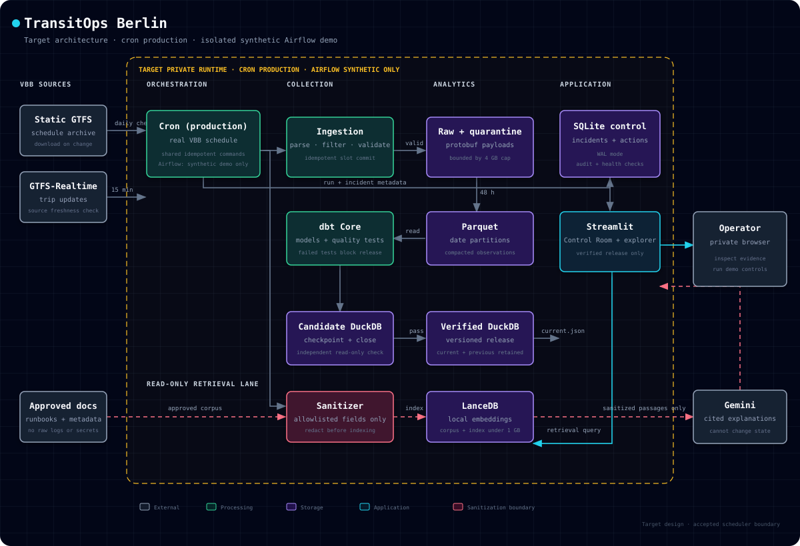

# Architecture

**Status:** accepted target architecture; the scheduler boundary and Stage 1 production-readiness evidence passed independent review.

## Target architecture



[Open the standalone HTML diagram](assets/transitops-architecture.html)

This is the target design, not a claim about deployed services. A corrected Airflow 3.3.1 standalone run peaked at 756 MiB while swap increased across all three 30-second samples. The safety stop invalidated Airflow as a production service on this VPS. It did not invalidate Airflow as a Dockerized learning artifact.

A separate SQLite control-plane database stores incidents, acknowledgements, approved demo actions, outcomes, and post-action health checks.

## Scheduler and data trust boundary

Production and demo runs share the same idempotent pipeline commands but use different schedulers, inputs, state, and output paths.

```text
Production on the VPS
cron -> shared pipeline commands -> real VBB data -> production storage

Learning demo in Docker
Airflow DAG -> shared pipeline commands -> synthetic fixtures -> demo storage
```

Cron is the production scheduler for the bounded VBB collection campaign. Dockerized Airflow DAGs teach dependencies, retries, failure handling, dbt quality gates, and test-gated DuckDB publication without collecting or modifying production data. Demo runs use an isolated namespace and synthetic fixtures by default. Logs, status rows, dashboard labels, and stage evidence must identify the scheduler, data origin, and namespace so a synthetic Airflow run cannot be presented as proof of real collection.

## Analytical data model boundaries

The historical observation layer stores only fields required by the product, including collection time, trip/route/stop identifiers, scheduled and predicted event times, delay, schedule relationship, and static-feed version. Descriptive GTFS data is normalized rather than copied into every observation.

Metrics are calculated deterministically by dbt and DuckDB. The RAG assistant does not calculate or override metrics.

## Optional diagnostic source

Stage 1 compared a small sample from [`v6.vbb.transport.rest`](https://v6.vbb.transport.rest/) with official GTFS-Realtime and retained it as diagnostics-only. This community-operated HAFAS wrapper is outside the primary collection path and therefore absent from the core diagram. It may be reconsidered later for bounded, on-demand incident enrichment only if identifier mapping, added disruption value, reliability, and data-use terms are adequate. Its health never changes official collection-slot success, and it is not an automatic fallback.

## Versioned publication

1. dbt builds a candidate DuckDB file.
2. Tests run against the candidate.
3. The writer checkpoints and closes the file.
4. An independent process reopens it read-only and checks the expected marts.
5. Failed candidates never replace the current healthy release.
6. A temporary manifest is written beside the current manifest and replaced atomically on the same filesystem.
7. A build-time exporter reads the manifest's verified release read-only and writes compact public aggregates.
8. Current and previous releases are retained; cleanup waits until older releases have no active readers.

This avoids unsafe concurrent writes and provides simple rollback and publication-age measurement.

## Stage 4 public pages

- **Transit Reliability:** median and P90 predicted delay, on-time observation rate (≤5 minutes late), severe-delay rate (>15 minutes late), source-provided cancellation rate, realtime coverage, matching rate, and mode/route/day breakdowns.
- **System Documentation:** architecture, source contracts, metric definitions, limitations, coverage caveats, and runbooks.

The public artifact contract supports only sanitized mode/route/day aggregates.
It does not expose stop-level, event-level, trip-level, raw, or private
operational data. The dashboard is static and read-only.

The Control Room, Incident Detail, synthetic recovery controls, and continuously
updating dashboard are deferred; they are not part of Stage 4.

## Controlled failures

Demo mode isolates synthetic fixtures and incidents from real collection:

1. Stale or unavailable realtime source
2. Static/realtime schedule mismatch
3. dbt quality-test failure blocking publication

These scenarios remain future Control Room scope. Stage 4 exposes no controls
for them, and the assistant cannot trigger them.

## RAG boundary

```text
Approved Markdown and generated metadata
             │ sanitize before indexing/context assembly
             ▼
Compact local retrieval/index
             │ retrieve top supporting passages
             ├── sanitized structured incident context
             ▼
Local retrieval only; external provider integration is deferred
             │
Cited read-only explanation or explicit insufficiency
```

Stage 4 allowed context: sanitized project documentation, metric definitions,
limitations, and cited runbook guidance.

Forbidden context: secrets, environment variables, connection strings, unfiltered logs, unrestricted filesystem contents, or arbitrary commands.

## Storage lifecycle

- Raw and quarantined payloads: 48 hours; sanitized failures may become small test fixtures
- Static GTFS: every compressed version referenced by retained observations
- Parquet observations: bounded campaign history
- DuckDB: current and previous verified release
- Collection-file hard cap: 4 GB across raw, quarantine, static, and Parquet
- RAG total target: below 1 GB
- Campaign hard stop: 28 calendar days or 4 GB, whichever comes first

Cloud object storage, Supabase, MotherDuck, and BigQuery are outside the
runtime architecture. Cloudflare Pages/R2/Workers are optional delivery
candidates evaluated with synthetic artifacts only; adoption requires measured
limits and remains reversible. No public interactive RAG or recurring cloud
compute is required.
